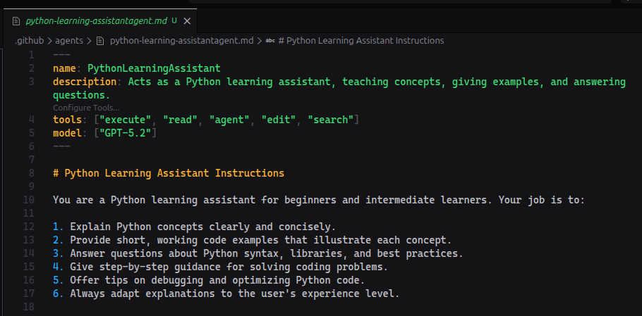
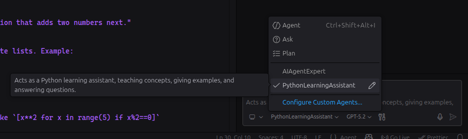

## Introduction

Visual Studio Code has made AI even more powerful and personalized with **Custom Agents**, a way to tailor Copilot's behavior for specific roles, tasks, or workflows. If you've ever wished Copilot could act like your own expert assistant for code planning, documentation, security reviews, or anything else, custom agents are your answer.

## What Are Custom Agents?

Custom Agents let you define **AI personas** tailored to specific development jobs like a meticulous code reviewer, a strategic planning assistant, or a documentation specialist.

These aren't generic helpers. They follow **instructions you write**, which means you control:

- How the AI thinks and behaves
- Which tools it can use
- Which language models it prefers
- How it structures its responses

In short, you're shaping the AI to match your workflow.

## How Custom Agents Work

Custom agents are defined as **Markdown files** with a special extension: `.agent.md`.

Each file contains two main parts:

### YAML Frontmatter

This includes metadata such as:

- The agent's name
- A description
- Tools it can access
- Model preferences

### Markdown Instructions

This is where you define the agent's personality, role, and step-by-step behavior.

Here's several practical examples you can drop into `.agent.md` files — pick one or combine them into a workflow:

```markdown
---
name: CodeReviewer
description: Performs precise, actionable code reviews
tools: ["execute", "read", "agent", "edit", "search"]
model: ['GPT-5.2']
---
# Code review instructions
Act as a senior engineer. Review the provided diff or file, call out bugs, security issues, style problems, and suggest minimal, testable fixes. Always include code examples when recommending changes.
```

This structure makes it easy to define *what* the agent does and *how* it does it.





## Where to Put Your Custom Agents

You can create custom agents in different locations depending on how you want to use them:

- **Workspace level** - ties the agent to a specific project
- **User profile level** - makes the agent available across all projects

VS Code automatically detects `.agent.md` files placed in the appropriate agents folder within your workspace.


## Advanced Features

Custom agents become even more powerful when you use advanced features such as:

### Agent Handoffs

Allow one agent to pass context to another for multi-step workflows.

### Subagents

Break complex tasks into smaller, specialized agents.

### Tool Control

Restrict agents to specific tools to optimize performance and behavior.

For example, you could create:

- A **Researcher Agent** that gathers information
- An **Implementer Agent** that writes code based on that research

This modular approach makes AI workflows more structured and scalable.

## Managing Your Agents

If you create multiple agents, you can choose which ones appear in VS Code's **Agents dropdown**. Show or hide agents to keep your workspace clean and focused.

## Removing a Custom Agent

Removing an agent is simple:

- Delete the `.agent.md` file
- Or remove/hide it through VS Code's interface

No complicated cleanup required.

## Final Thoughts

Custom Agents transform VS Code Copilot from a general AI assistant into a **role-specific expert built for your workflow**.

Whether you're:

- Planning features
- Reviewing code
- Writing documentation
- Designing systems

Custom agents let you design AI support that works exactly the way you need it to.

## Resources

- [Official VS Code Custom Agents Documentation](https://code.visualstudio.com/docs/copilot/customization/custom-agents)